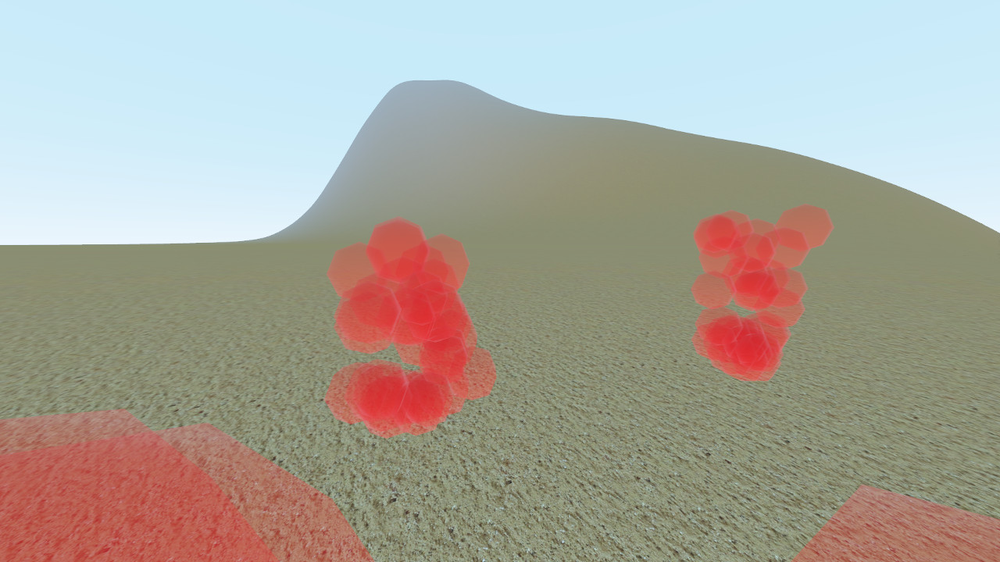

## Hyperweb-Testgame

This explores features of a first-person multiplayer game using ...

  * Godot 3.5 as game engine,
  * Blender 2.83+ to create assets,
  * glTF 2.0 as transmission format between Blender and Godot.

To play the game, first start a server instance with the command line parameter "`--server`".  
You can then start one or more client instances.

The intentionally simple level can easily be replaced with your own creations.

Please visit [https://hyperweb.eu/en/testgame/](https://hyperweb.eu/en/testgame/) for more details.

### Title scene

